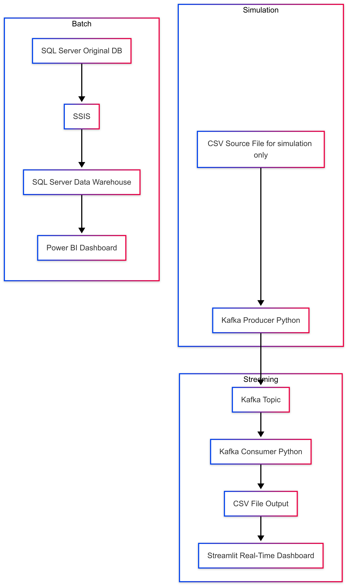

# 🛍️ Global Fashion Retail Sales - Lambda-Inspired Architecture Project

This project demonstrates a real-world **Lambda-Inspired Data Architecture** for analyzing fashion retail sales across multiple countries, using **separate dashboards** for batch and streaming layers.

It simulates a hybrid setup combining historical data in a data warehouse with real-time transaction data streamed from a cashier system.

---

## 🌍 Project Overview

A fashion retail company operates stores across 7 countries (Brazil, USA, China, France, Germany, etc.).  
The goal is to build a dual-pipeline system that:

- Handles **historical data** for deep analytics.
- Handles **live transaction data** for real-time monitoring.
- Presents both views via **dedicated dashboards**.


  

---

## 🧱 Architecture Summary

This solution adopts a **Lambda-Inspired Architecture**, split into two separate paths:

### 1️⃣ Batch Layer (Historical Data)
- **Source:**  
  Historical data is stored in **Microsoft SQL Server**.

- **ETL Process:**  
  Data is extracted and transformed using **SSIS**, then loaded into a **Data Warehouse** (also SQL Server).

- **Visualization:**  
  The data warehouse is connected to **Power BI**, which provides a rich analytical dashboard.

---

### 2️⃣ Streaming Layer (Live Data Simulation)
- **Simulation:**  
  Live cashier transactions are **simulated using Python** and streamed in real-time.

- **Streaming Pipeline:**  
  - Data is sent to **Apache Kafka** (via Kafka Mini on Docker).
  - A **Kafka Consumer** written in Python receives the data.
  - The consumer writes the streamed records to a **CSV file**.

- **Visualization:**  
  A **Streamlit app** reads from the CSV and presents **live KPIs** such as:
  - Latest transactions
  - Total quantity sold
  - Real-time revenue

---

## 🔁 Data Flow

```text
           ┌────────────────────┐
           │   CSV Source File  │  (Used for simulation only)
           └────────┬───────────┘
                    │
                    ▼
           ┌────────────────────┐
           │ Batch Path (DB)    │
           │ - SQL Server       │
           │ - SSIS             │
           └────────┬───────────┘
                    ▼
           ┌────────────────────┐
           │ Data Warehouse     │
           │ - SQL Server DW    │
           └────────┬───────────┘
                    ▼
              ┌────────────┐
              │ Power BI   │◄──────── Historical Dashboard
              └────────────┘

  (Parallel Stream)
                    ▲
                    │
           ┌────────┴──────────┐
           │ Kafka Producer    │◄──── Simulated by Python
           └────────┬──────────┘
                    ▼
              ┌────────────┐
              │ Kafka      │
              └────────────┘
                    ▼
           ┌───────────────────┐
           │ Kafka Consumer    │
           │ - Writes to CSV   │
           └────────┬──────────┘
                    ▼
              ┌────────────┐
              │ Streamlit  │◄──────── Real-time Dashboard
              └────────────┘
```

## 📂 Project Structure

📁 batch/
   ├── SQL Scripts
   ├── SSIS Packages
   └── Power BI Reports (.pbix)

📁 streaming/
   ├── producer.py
   ├── consumer.py
   └── streamlit_app.py

📁 kafka/
   └── docker-compose.yml

📁 data/
   ├── sample_source.csv
   └── live_transactions.csv (stream output)


## 🛠️ Tools & Technologies
Microsoft SQL Server – source & warehouse

SSIS – batch ETL pipeline

Apache Kafka (Docker) – real-time messaging

Python – Kafka producer, consumer, Streamlit app

Power BI – analytical dashboard

Streamlit – real-time dashboard


## 📊 Dashboards

  Power BI: Country-wise trends, product sales, revenue analysis (based on historical warehouse).

  Streamlit: Real-time view of incoming transactions, KPIs, and live metrics

## 🔀 Design Note
This architecture is Lambda-Inspired, but instead of unifying batch and streaming into one serving layer, the system uses:

   Two separated dashboards for better performance and clarity.

  A clear distinction between historical insights (Power BI) and real-time metrics (Streamlit)

## 🚀 How to Run


 #  Start Kafka Mini:

    docker-compose up -d

# Run the Kafka Producer (simulated cashier stream):

    python producer.py

# Start the Kafka Consumer (writes to CSV):

    python consumer.py

# Launch Streamlit dashboard:

    streamlit run streamlit_app.py

 ##  Batch Layer:

   Use SSIS to transfer data from SQL Server to warehouse.

   Open .pbix file in Power BI to view historical analysis.

## 🧠 Notes

   Deduplication and error handling are considered in the consumer to prevent inflated numbers.

   This setup is ideal for prototyping real-time pipelines before scaling to full cloud-based solutions
